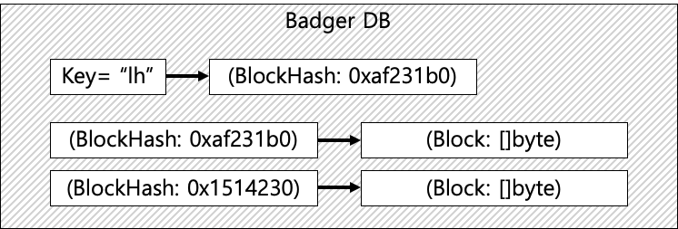

# 3. BadgerDB

지금까지는 블록체인을 메모리 안에서만 생성했기 때문에 프로그램을 종료하면 없어졌다. 이번 강좌에서는 DB를 이용해서 블록체인을 저장하고 사용하도록 해보자.&#x20;

## Badger DB

* Key, Value 형태로 값을 저장하는 DB
* \[]byte 형태 저장한다. (저장하기 위해 형변환이 필요)
* badger.Txn
  * transaction을 말한다.&#x20;
  * DB에 일어나는 일련의 동작 묶음이다.&#x20;
  * txn.Set() 을 통해 값을 넣거나 바꾼다.
  * txn.Get() 을 통해 value 값을 받아온다. (Argument로 키값을 넣는다.)

#### 아래 디비 구조 그림 Reference





## blockchain.go

* BadgerDB를 생성하여 디비 포인터와 마지막 해쉬값을 blockchain struct에 저장한다.&#x20;
* 블록의 생성 및 추가를 디비와 연계했다.&#x20;
* 이터레이터를 추가하여 블록체인 구조를 순회할 수 있도록 했다.&#x20;

```go
package blockchain

import (
	"fmt"

	"github.com/dgraph-io/badger/v3"
)

const (
	// database Path.
	dbPath = "./tmp/blocks"
)

// BlockChain structure
// 마지막 해쉬를 저장하고 DB 포인터를 저장해서 블록을 관리.
type BlockChain struct {
	LastHash []byte
	Database *badger.DB
}

// BlockChainIterator : DB에 저장된 블록체인을 순회하기 위해 생성.
type BlockChainIterator struct {
	// 현재 가리키고 있는 hash
	CurrentHash []byte
	Database    *badger.DB
}

// InitBlockChain : Genesis 블록을 시작으로 하는 블록체인을 생성한다.
func InitBlockChain() *BlockChain {
	var lastHash []byte

	opts := badger.DefaultOptions(dbPath)
	// store key and metadata
	opts.Dir = dbPath
	// store all values
	opts.ValueDir = dbPath

	db, err := badger.Open(opts)
	Handle(err)

	// Update : read and write transactions on our databases.
	// Txn : Transaction, which can be read-only or read-write.
	err = db.Update(func(txn *badger.Txn) error {
		// Blockchain이 비어있다는 뜻. (KeyNotFound)
		// lh(last hash) key 가 없음.
		if _, err := txn.Get([]byte("lh")); err == badger.ErrKeyNotFound {
			fmt.Println("No existing blockchain found")
			// 검증된 Genesis Block을 생성.
			genesis := Genesis()
			fmt.Println("Genesis proved")

			// transaction에 저장.
			// genesis.Hash -> genesis.Seriaize()
			err = txn.Set(genesis.Hash, genesis.Serialize())
			Handle(err)
			// lh -> genesis.Hash
			err = txn.Set([]byte("lh"), genesis.Hash)

			lastHash = genesis.Hash

			return err
			// lh key가 존재하는 경우.
		} else {
			// lh 키의 value를 lastHash에 할당.
			item, err := txn.Get([]byte("lh"))
			Handle(err)
			lastHash, err = item.ValueCopy(nil)
			return err
		}
	})

	Handle(err)

	blockchain := BlockChain{lastHash, db}
	return &blockchain
}

// AddBlock : data의 값을 가지는 블록을 추가한다.
func (chain *BlockChain) AddBlock(data string) {
	var lastHash []byte

	// View : read-only type of transaction
	err := chain.Database.View(func(txn *badger.Txn) error {
		// 마지막 해쉬를 찾는다.
		item, err := txn.Get([]byte("lh"))
		Handle(err)
		lastHash, err = item.ValueCopy(nil)

		return err
	})
	Handle(err)

	// 이전 해쉬값과 데이터로 새로운 블록을 생성.
	newBlock := CreateBlock(data, lastHash)

	err = chain.Database.Update(func(txn *badger.Txn) error {
		// 새로운 블록의 해쉬값을 저장한다.
		err := txn.Set(newBlock.Hash, newBlock.Serialize())
		Handle(err)
		// lh 키값을 새로운 블록의 해쉬값으로 바꾼다.
		err = txn.Set([]byte("lh"), newBlock.Hash)

		// BlockChain의 마지막 해쉬를 새로운 블록의 해쉬값으로 지정한다.
		chain.LastHash = newBlock.Hash

		return err
	})
	Handle(err)
}

// Iterator : 블록체인 이터레이터. LastHash부터 이전 해쉬로 가며 순회할 수 있다.
func (chain *BlockChain) Iterator() *BlockChainIterator {
	iter := &BlockChainIterator{chain.LastHash, chain.Database}

	return iter
}

// Next : BlockChain의 다음 블록을 반환한다.
func (iter *BlockChainIterator) Next() *Block {
	var block *Block

	err := iter.Database.View(func(txn *badger.Txn) error {
		// 현재 가리키고 있는 hash를 deserialize해서 Block을 복원한다.
		item, err := txn.Get(iter.CurrentHash)
		Handle(err)
		encodedBlock, err := item.ValueCopy(nil)
		block = Deserialize(encodedBlock)

		return err
	})
	Handle(err)

	// iter가 이전 해시를 가리키도록 한다.
	iter.CurrentHash = block.PrevHash

	return block
}

```

## block.go

* BadgerDB에 값을 넣기 위해서 \[]byte 타입으로 바꿔주어야 하기 때문에 Serialize, Deserialize 유틸 함수를 추가했다.&#x20;

```go
package blockchain

import (
	"bytes"
	"encoding/gob"
	"log"
)

// Block structure
type Block struct {
	Hash       []byte
	Data       []byte
	PrevHash   []byte
	Nonce      int
	Difficulty int
}

// CreateBlock : data와 prevHash를 받아서 새로운 Hash를 생성한 블록을 생성한다.
// difficulty를 조절한다. 여기서는 그냥 고정값으로 넣었다.
func CreateBlock(data string, prevHash []byte) *Block {
	difficulty := 12
	block := &Block{[]byte{}, []byte(data), prevHash, 0, difficulty}

	// PoW 조건에 맞는 블록을 생성한다.
	pow := NewProof(block)
	nonce, hash := pow.Run(difficulty)

	block.Hash = hash[:]
	block.Nonce = nonce
	block.Difficulty = difficulty

	return block
}

// Genesis : 체인의 맨 처음 블록이다. prevHash 값이 비어있다.
func Genesis() *Block {
	return CreateBlock("Genesis", []byte{})
}

// Serialize : BadgerDB 에 값을 넣기 위해 byte배열로 바꿔준다.
func (b *Block) Serialize() []byte {
	var res bytes.Buffer
	encoder := gob.NewEncoder(&res)

	err := encoder.Encode(b)

	Handle(err)

	return res.Bytes()
}

// Deserialize : data를 decoding 해서 Block객체로 바꿔준다.
func Deserialize(data []byte) *Block {
	var block Block

	decoder := gob.NewDecoder(bytes.NewReader(data))

	err := decoder.Decode(&block)

	Handle(err)

	return &block
}

// Handle : Error handling.
func Handle(err error) {
	if err != nil {
		log.Panic(err)
	}
}

```

## main.go

* CommandLine 으로 블록의 추가와 블록체인 전체 출력을 하도록 했다.

```go
package main

import (
	"flag"
	"fmt"
	"os"
	"runtime"
	"strconv"

	"github.com/HTaeha/Blockchain-in-Golang/blockchain"
)

// CommandLine : CommandLine으로 원하는 동작을 실행시킬 수 있도록 한다.
type CommandLine struct {
	blockchain *blockchain.BlockChain
}

// printUsage : print cli의 사용법을 알려준다.
func (cli *CommandLine) printUsage() {
	fmt.Println("Usage:")
	fmt.Println(" add -block BLOCK_DATA - add a block to the chain")
	fmt.Println(" print - Prints the blocks in the chain")
}

// validateArgs : Argument를 검증한다.
func (cli *CommandLine) validateArgs() {
	if len(os.Args) < 2 {
		cli.printUsage()
		// runtime.Goexit은 현재 goroutine을 종료시킨다.
		// main 프로그램은 정상적으로 돌기 때문에 DB가 충돌을 일으키지 않고 종료할 수 있다.
		// os.exit()을 사용하면 프로그램 자체를 종료시키기 때문에 DB가 정상종료되지 않을 수 있다.
		runtime.Goexit()
	}
}

// addBlock : cli를 통해 블록을 추가한다.
func (cli *CommandLine) addBlock(data string) {
	cli.blockchain.AddBlock(data)
	fmt.Println("Added Block!")
}

// printChain : 블록체인에서 마지막부터 첫번째 블록 내용을 출력한다.
func (cli *CommandLine) printChain() {
	iter := cli.blockchain.Iterator()

	for {
		block := iter.Next()

		fmt.Printf("Previous Hash: %x\n", block.PrevHash)
		fmt.Printf("Data: %s\n", block.Data)
		fmt.Printf("Hash: %x\n", block.Hash)

		// Validate 과정은 매우 빠르게 처리된다.
		pow := blockchain.NewProof(block)
		fmt.Printf("PoW: %s\n", strconv.FormatBool(pow.Validate()))
		fmt.Println()

		if len(block.PrevHash) == 0 {
			break
		}
	}
}

// run Command Line Interface.
func (cli *CommandLine) run() {
	cli.validateArgs()

	addBlockCmd := flag.NewFlagSet("add", flag.ExitOnError)
	printChainCmd := flag.NewFlagSet("print", flag.ExitOnError)
	addBlockData := addBlockCmd.String("block", "", "Block data")

	switch os.Args[1] {
	// add command 일 때 파싱
	case "add":
		err := addBlockCmd.Parse(os.Args[2:])
		blockchain.Handle(err)

	// print command 일 때 파싱
	case "print":
		err := printChainCmd.Parse(os.Args[2:])
		blockchain.Handle(err)

	default:
		cli.printUsage()
		runtime.Goexit()
	}

	if addBlockCmd.Parsed() {
		// addBlockData가 없으면 Usage() 실행 후 종료.
		if *addBlockData == "" {
			addBlockCmd.Usage()
			runtime.Goexit()
		}
		// 블록 추가.
		cli.addBlock(*addBlockData)
	}

	// print command 일 때 printChain()을 실행.
	if printChainCmd.Parsed() {
		cli.printChain()
	}
}

func main() {
	defer os.Exit(0)
	chain := blockchain.InitBlockChain()
	// 메인이 종료되기 전에 DB를 종료.
	defer chain.Database.Close()

	cli := CommandLine{chain}
	cli.run()
}

```

## proof.go

* 기존 코드의 경우 데이터를 생성할 때 Difficulty를 사용하지만 Validate에서는 Difficulty를 상요하지 않아서 Difficulty를 변경하며 블록을 생성했을 경우 Difficulty 값이 다르게 생성된 블록의 경우 false를 반환했다.&#x20;
* 블록 내부에 Difficulty를 저장하고 Validate에 해당 블록의 Difficulty를 반영하여 Difficulty를 수정해도 올바른 검증이 가능하도록 수정했다.&#x20;
* block.go 의 CreateBlock 함수에서 difficulty를 설정할 수 있도록 했다. 현재는 const값이지만 나중에는 블록체인의 상황에 따라 유동적으로 바뀌도록 할 수 있다.&#x20;
* Bitcoin 의 Difficulty 조절 방법
  * n의 블록이 생성된 후에 블록이 생성될때까지 걸린 시간을 체크한다.&#x20;
  * 10초에 1개의 블록이 생성 되기를 원한다.
  * 그렇다면 n개의 블록은 10\*n초의 시간이 걸려야 한다.&#x20;
  * 이보다 오래 걸렸으면 difficulty를 낮추고 적게 걸렸으면 difficulty를 올린다.
  * difficulty를 너무 올려버리면 다음 체크때까지 시간이 너무 오래 걸릴 수 있으므로 어느정도 올릴 수 있는 제한이 있다.

```go
package blockchain

import (
	"bytes"
	"crypto/sha256"
	"encoding/binary"
	"fmt"
	"log"
	"math"
	"math/big"
)

// Take the data from the block

// create a counter (nonce) which starts at 0

// create a hash of the data plus the counter

// check the hash to see if it meets a set of requirements

// Requirements:
// The First few bytes must contain 0s

// Difficulty : 채굴하기 위한 문제의 난이도.
// 256bit 중에 Difficulty만큼의 0을 찾는다.
// const Difficulty = 12

// ProofOfWork structure
type ProofOfWork struct {
	Block *Block
	// 정답. Target 보다 작은 값을 찾으면 정답이다.
	Target *big.Int
}

// NewProof : ProofOfWork 객체를 만들어 리턴한다.
func NewProof(b *Block) *ProofOfWork {
	target := big.NewInt(1)
	// Left shift : 아래 식의 결과는 2^(256-Difficulty)가 된다.
	// target은 전체 256비트 중에 왼쪽에 Difficulty-1 만큼의 0이 존재한다. (2진수)
	// 아래 값보다 작은 값이면 0이 Difficulty만큼 존재하는 것이기 때문에 정답이다.
	target.Lsh(target, uint(256-b.Difficulty))

	pow := &ProofOfWork{b, target}

	return pow
}

// InitData : PrevHash, Data, nonce, Difficulty 를 합쳐 데이터를 만든다.
func (pow *ProofOfWork) InitData(nonce, Difficulty int) []byte {
	data := bytes.Join(
		[][]byte{
			pow.Block.PrevHash,
			pow.Block.Data,
			ToHex(int64(nonce)),
			ToHex(int64(Difficulty)),
		},
		[]byte{},
	)

	return data
}

// Run : 정답을 찾아 nonce, hash 값을 반환한다.
// difficulty의 값이 클수록 난이도가 어려워진다. (run이 오래 걸린다.)
func (pow *ProofOfWork) Run(difficulty int) (int, []byte) {
	var intHash big.Int
	var hash [32]byte

	nonce := 0

	// MaxInt64 == 2^63 - 1
	for nonce < math.MaxInt64 {
		data := pow.InitData(nonce, difficulty)
		hash = sha256.Sum256(data)

		fmt.Printf("\r%x", hash)
		intHash.SetBytes(hash[:])

		// intHash가 pow.Target보다 작은 값이면 정답.
		if intHash.Cmp(pow.Target) == -1 {
			break
		} else {
			nonce++
		}
	}
	fmt.Println()

	return nonce, hash[:]
}

// Validate : PoW 가 유효한지 검증한다. 매우 간단하게 처리 가능하다.
// Run 할 때보다 매우 쉽고 빠르게 처리된다.
func (pow *ProofOfWork) Validate() bool {
	var intHash big.Int

	// Block의 Nonce값을 이용해 hash 값을 재현한다.
	data := pow.InitData(pow.Block.Nonce, pow.Block.Difficulty)

	hash := sha256.Sum256(data)
	intHash.SetBytes(hash[:])

	return intHash.Cmp(pow.Target) == -1
}

// ToHex : int64를 []byte로 변환.
func ToHex(num int64) []byte {
	buff := new(bytes.Buffer)
	err := binary.Write(buff, binary.BigEndian, num)
	if err != nil {
		log.Panic(err)
	}

	return buff.Bytes()
}

```

## Result

* go run main.go print
  * BlockChain 전체 노드를 출력한다.
* go run main.go add -block \[data]
  * \[data] 를 데이터로 가지는 노드를 추가한다.

```go
// 블록을 7개 생성한 후 출력한 모습이다.
// Difficulty를 바꿔가며 블록을 생성했지만 모두 제대로 검증된 것을 볼 수 있다. 
Previous Hash: 00000ad03df10d90dd9e9d80d7edf298766d4e494b94f7ee47626671a71aaa6c
Data: test12
Hash: 0002da7f56f3a390f83119d364fe204b4245dbd90a376e4d960908747f703280
PoW: true

Previous Hash: 00030c0beb186d5d886973a80a5f64ab1bc554bea9acb478d7f389728716545a
Data: test18
Hash: 00000ad03df10d90dd9e9d80d7edf298766d4e494b94f7ee47626671a71aaa6c
PoW: true

Previous Hash: 0000037e524f932bb1cb743fc0298d32fbbf81b7fcee7e7eacbb3f31ce1da300
Data: test
Hash: 00030c0beb186d5d886973a80a5f64ab1bc554bea9acb478d7f389728716545a
PoW: true

Previous Hash: 0005a472e7f14826f3e1241b8fda875916441d9ad292a2939f6c0b5850cf71a9
Data: difficulty18
Hash: 0000037e524f932bb1cb743fc0298d32fbbf81b7fcee7e7eacbb3f31ce1da300
PoW: true

Previous Hash: 000f75abfa51468e78270ff9ba19ee95cfd2eb94ca5b9a6f41a90c170076b663
Data: taeha's block
Hash: 0005a472e7f14826f3e1241b8fda875916441d9ad292a2939f6c0b5850cf71a9
PoW: true

Previous Hash: 00031a02a972efd4fa6ea999407149b85b03ccecb8c2bb8eb5a1d068862309d0
Data: firstblock
Hash: 000f75abfa51468e78270ff9ba19ee95cfd2eb94ca5b9a6f41a90c170076b663
PoW: true

Previous Hash: 
Data: Genesis
Hash: 00031a02a972efd4fa6ea999407149b85b03ccecb8c2bb8eb5a1d068862309d0
PoW: true
```

## Code



