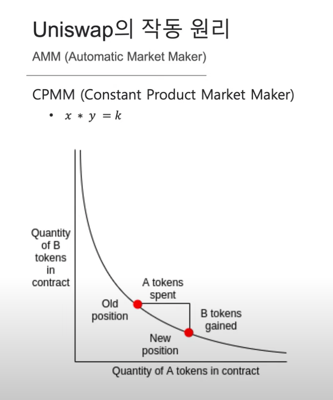

# Concept

#### 유니스왑이란

* 탈중앙화 거래소
* 스마트 컨트랙트를 이용하여 중앙화되지 않은 거래소
* 유니스왑을 따라한 스시스왑 등의 DEX가 나오고 있고 유니스왑의 거래량이 가장 많다.

## 역사

Hayden Adams가 개발하였고 Devcon4 마지막 날 발표했다.

Hayden Adams는 원래 기계공학자였는데 회사에서 잘리고 이더리움의 PoS 연구를 하던 친구(Karl Floersch)의 추천을 받아 Uniswap을 만들게 됐다.

탈중앙화 플랫폼의 특징을 잘 이해하고 있다.

기존의 중앙화 거래소에서는 호가창에 매도, 매수 요청을 사람들이 올리고 그것을 매칭하여 거래가 이루어진다. 중앙화 거래소에서는 그런 작업들이 빠르게 이루어질 수 있는데 탈중앙화 거래소에서는 트랜잭션 처리 속도가 느리기 때문에 (이더리움의 경우 아무리 빨라도 15초 뒤에 승인이 난다.) 작업을 처리하는 속도가 굉장히 느리다. 또한 모든 트랜잭션 처리에는 수수료가 들게 된다. 중앙화 거래소의 경우 거래가 이루어질 경우만 수수료를 받지만 탈중앙화인 경우 거래 승인 뿐만 아니라 취소, 변경 등 모든 트랜잭션에서 수수료가 발생하게 된다. 따라서 중앙화 거래소의 방식을 따라 탈중앙화 거래소를 만들면 굉장히 느리고 비효율적인 거래소가 된다.

## AMM(Automatic Market Maker)

기존의 중앙화 거래소는 사람들이 팔고 싶은 가격, 사고 싶은 가격을 정해서 유동성을 공급한다. 유니스왑은 유동성 공급을 사람들이 하게 하지 않고 어떤 공식을 따르도록 했다. 그래서 토큰 A, B의 교환 비율이 자동적으로 정해지게 했다.

### CPMM (Constant Product Market Maker)

* x \* y = k
* x : 토큰 A의 수량
* y : 토큰 B의 수량
* k : 상수
* 두 토큰의 수량을 곱해서 상수가 나오도록 하는 것이 CPMM

#### 예시

ETH 10개와 OMG 500개가 있어서 두 코인의 수량의 곱이 5000으로 맞춰지는 스마트 컨트랙트가 있다고 하자.

.png>)

1. 1 ETH를 OMG로 바꾸려고 한다.
   * 1 ETH를 컨트랙트에 보낸다.
   * ETH의 수량이 10개에서 11개로 변한다.
   * OMG는 두 코인의 곱을 5000으로 맞추기 위해 5000/11개가 된다. 대략 454.5개.
   * 1 ETH를 OMG로 바꾸려고 한 사람은 500-454.5를 해서 45.5OMG를 받는다.
   * 1:45.5 의 교환 비율

.png>)

1. 또 한번 1 ETH를 OMG로 바꾸려고 한다.
   * ETH의 수량이 11개에서 12개로 변한다.
   * OMG는 5000/12를 해서 416.7개가 된다.
   * 이 사람은 454.5 - 416.7 을 해서 38개 정도의 OMG토큰을 받게 된다.

두 번의 교환이 이뤄진 후

* 교환 비율이 달라졌다. OMG가 비싸졌다.
* OMG를 팔고 ETH를 가져오고 싶은 사람들이 생겨난다.
* 이들을 차익거래자라고 하는데 교환비율이 달라졌을 때 ETH를 싸게 사서 다른 곳에서 교환하면 차익을 가져올 수 있다.
* 차익거래자들이 OMG를 공급하기 때문에 결국 이 교환비는 시장에서 거래되는 ETH와 OMG의 비율까지 맞춰지게 된다.
* 오차범위는 수수료 범위 정도밖에 되지 않는다.

→ 호가가 없이도 유동성을 공급하도록 만들었다!

풀이 크면 교환 비율이 잘 달라지지 않고 안정적이기 때문에 풀이 큰 것이 중요하다.

## 유니스왑 컨트랙트

유니스왑은 두개의 코인 사이에 유동성을 제공하기 때문에 항상 pair로 이들을 관리한다.

크게 Factory contract와 Token exchange contract가 있다.

#### Factory contract

Pair인 두 코인을 대상으로 컨트랙트를 만들고 그 안에 pool을 만든다. 풀에 있는 토큰의 수량은 서로 곱이 일정하다.

교환하고자 하는 코인들을 pair로 만들기 때문에 교환하고 싶은 모든 pair에 대한 컨트랙트를 만들어줘야 한다. 이더리움에는 기축 통화가 명확히 있지 않기 때문에 5\~6개의 많이 교환을 하는 토큰들과 토큰 pair를 형성해야 한다.

AMM은 효율적이지만 컨트랙트 주소는 그다지 효율적이지 않다. 10개 토큰이 모두 pair를 이룬다고 하면 10C2 = 45개의 컨트랙트가 필요하다.

Factory contract에는 모든 토큰 pair들에 대한 컨트랙트들의 address가 들어있다.

.png>)

#### 예시

1. DAI를 ETH로 교환하고 싶은 사람이 있다.
2. Factory Contract에 createExchange라고 하는 function을 부른다.
3. createExchange에서 DAI address를 확인.
4. ETH-DAI pair에 대한 Token Exchange 컨트랙트 주소를 찾는다.
5. AMM에 의해 교환이 이루어진다.

.png>)

## LP Tokens

LP (Liquidity Provider) : 유동성 공급자

유동성 공급자들이 토큰을 되돌려 받고 싶을 때 얼마를 받아야 되는지에 대해서 알려주는 증거로 LP token을 발행한다.

* LP 는 reserve를 제공하고 LP token(liquidity share)을 받는다.
* LP token은 reserve를 withdraw할 때 받을 수 있는 token 양과 매핑된다.
* 또한, LP token은 Uniswap에서 token을 swap한 trader들이 낸 수수료(0.3%)를 전체 token pool에서 자신의 LP token의 지분만큼 요청할 수 있다.

.png>)

#### 예시

1. 어떤 사람이 A 토큰 10개, B 토큰 1개를 reserve 했다.
2. A-B pair에 해당하는 token exchange contract에 보관이 된다.
3. 이 컨트랙트에서 이 풀에 해당하는 토큰이 발행된다.
4. 그림을 보면 12개가 발행되어 있고 이 사람은 4개를 받았다.
5. 나중에 유동성 공급했던 토큰을 다시 돌려받고 싶을 때 LP token 4개를 돌려주면 A 토큰 10개, B 토큰 1개를 돌려받을 수 있다.

LP 들은 전체 LP token풀 중에서 자기 LP token의 지분만큼 수수료를 share받을 수 있다.

유니스왑의 수수료는 0.3%이다. 0.3% 중에서 자기 지분만큼 수수료를 받는다.

위 그림의 경우를 보면 전체 12개의 LP token이 있고 본인은 4개의 LP 토큰이 있기 때문에 0.3% \* 4/12 = 0.1%의 수수료를 받을 수 있다.

사람들은 교환이 많이 일어날 것 같은 pair에 유동성을 공급할 것이고(수수료를 많이 얻기 위해) 해당 pair는 많은 유동성이 공급되어 있기 때문에 안정적으로 거래할 수 있다.

## 유니스왑의 성장

유니스왑은 Ethereum Foundation, Paradigm 등 여러 곳에서 투자를 받았다. 2200억원 정도의 유동성을 공급하고 있고 유니스왑은 다른 거래소들에 비해 수수료가 저렴하다.

.png>)

## Reference


